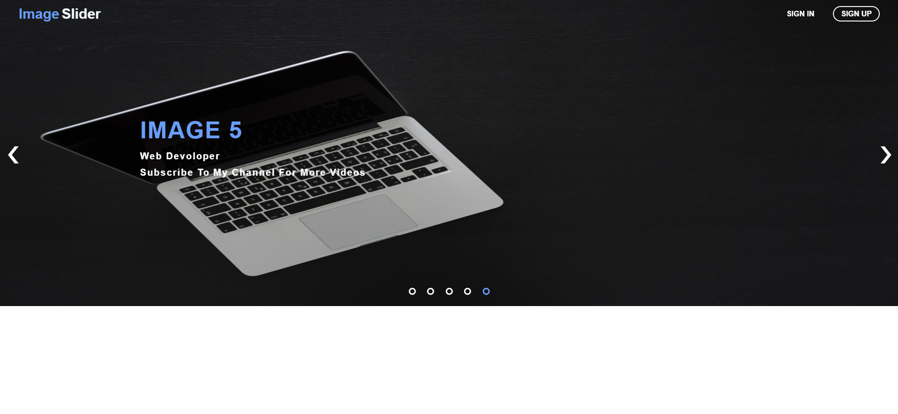

# 🖼️ Responsive Image Slider

A clean, responsive, and lightweight **responsive image slider/carousel** built using **HTML, CSS and JavaScript**, designed to showcase images smoothly across all devices and screen sizes.


## 📝 Description

**Responsive Image Slider** is a beautiful, smooth and responsive login page built entirely with **HTML**, **CSS** and **JavaScript**.
It features stunning background animations, a modern glassmorphism-style UI and an elegant hover effect — **automatic zoomable and slideshow**.

This project is perfect for:
- 💻 Frontend developers looking to enhance their CSS animation skills
- 🎨 Designers creating stylish login interfaces
- 📁 Web projects that need a minimal, professional login page


## ✨ Features

- 🌐 Fully **responsive design** for desktop, tablet and mobile  
- 🔄 **Automatic sliding** with configurable speed  
- ⬅️➡️ **Manual navigation** with previous/next buttons  
- ⚡ Smooth **transition animations**  
- 🖌️ Modern **clean UI** with minimal styling  
- 📦 Lightweight, dependency-free, no frameworks required  
- 💡 Easy to **customize** with your own images and styles  


## 📌 Technologies Used

- **HTML5** – Structure of the gallery.
- **CSS3** – Styling, hover effects, and responsive design.
- **JavaScript** – Dynamic image rendering, slider functionality and event handling.


## 📸 Sreenshots

Here are some screenshots of the `Responsive Image Slider` project:

**Image Slider**<br/>
<br/>


## 🧰 Requirements

To view or modify this project, you’ll need:

- 🧭 Any modern web browser (Chrome, Firefox, Edge, Safari)
- 🖋️ A text editor (VS Code, Sublime Text, Atom)
- 🧠 Basic understanding of HTML, CSS and JavaScript


## ⚙️ Installation Guide

You can run this project locally in just a few steps:

```bash
# 1. clone this repository
git clone https://github.com/iamx-ariful-islam/responsive-image-slider.git

# 2. navigate to the project folder
cd responsive-image-slider

# 3. add your images into the images folder (if needed)

# 4. open index.html in your browser
```


## 📂 Folder Structure

Here’s the structure of the **Responsive Image Slider** project:

```bash
Responsive-Image-Slider/
│
├── images/
├── screenshots/
├── index.html
├── LICENSE
├── README.md
├── script.js
└── styles.css
```


## 🤝 Contributing

Contributions, suggestions, and feedback are always welcome! ❤️<br/>
To contribute:

1. Fork the repository
2. Create a new branch (`feature/new-feature`)
3. Commit your changes
4. Push and submit a Pull Request

💬 You can also open an issue if you’d like to discuss a feature or report a bug.


## 🌐 For more or connect with me

<p align='center'>
  <a href="https://github.com/iamx-ariful-islam"></a>&nbsp;&nbsp;
  <a href="https://bd.linkedin.com/in/iamx-ariful-islam"></a>&nbsp;&nbsp;
  <a href="https://x.com/mx_ariful_islam"></a>&nbsp;&nbsp;
  <a href="https://www.facebook.com/iamx.ariful.islam/"></a>
</p>


## 📜 License

The [MIT](https://choosealicense.com/licenses/mit/) License (MIT)


<h2 align="center">💖 Thank You for Visiting!</h2>

<p align="center">
  “Good design is about making things simple yet significant”<br>
  — <a href="https://github.com/iamx-ariful-islam" target="_blank"><strong>Md. Ariful Islam</strong></a>
</p>